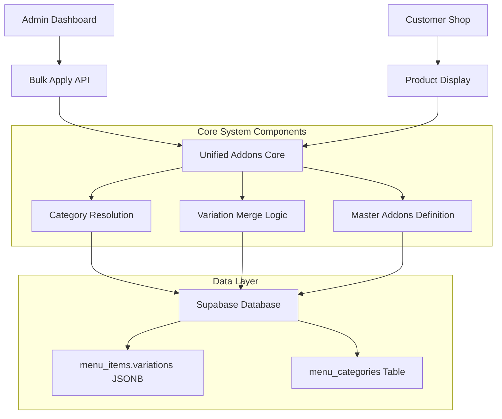
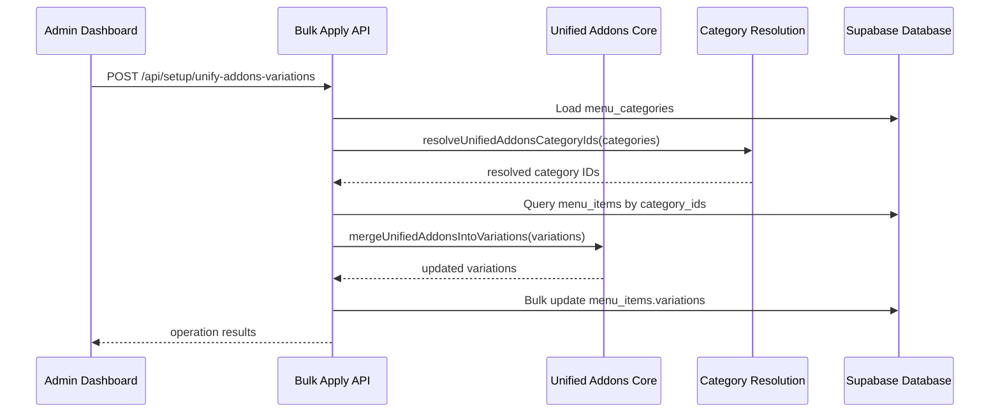
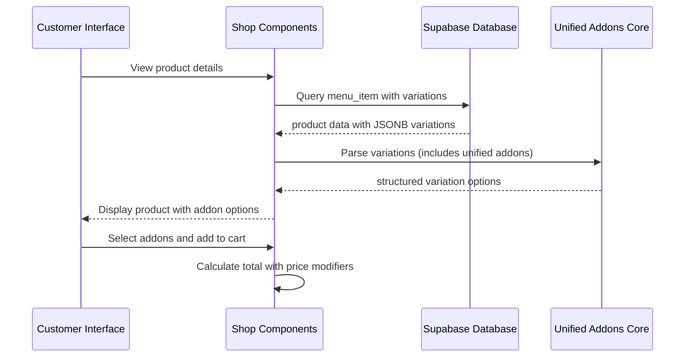

# Design Document: Unified Addons System

## Overview

The Unified Addons System is a comprehensive product variation management solution for the coffee shop application that standardizes addon options across different drink categories. The system provides a centralized approach to managing 15 standardized addon options (ranging from $0.50 to $5.00) that are automatically applied to eligible product categories including Kids Drinks, Meal Replacement Shakes, Specialty Drinks, Cold Drinks, Beauty Drinks, Loaded Tea, and Café beverages. The system integrates seamlessly with both the customer-facing shop interface and the admin dashboard, utilizing a JSONB-based storage approach in Supabase for flexible variation management while maintaining data consistency and enabling bulk operations.

## Architecture

The system follows a modular architecture with clear separation of concerns between data definition, business logic, and API interfaces:



## Sequence Diagrams

### Bulk Apply Workflow



### Customer Product View Workflow



## Components and Interfaces

### Component 1: Master Addons Definition

**Purpose**: Centralized definition of the 15 standardized addon options with consistent pricing and labeling

**Interface**:
```typescript
interface UnifiedAddonsDefinition {
  UNIFIED_ADDONS_VARIATION_ID: string
  UNIFIED_ADDONS_VARIATION: ProductVariation
  cloneUnifiedAddonsVariation(): ProductVariation
}
```

**Responsibilities**:
- Maintain canonical list of 15 addon options with pricing
- Provide versioning support for addon definitions (v1 → v2 migration)
- Ensure consistent addon IDs and labels across the system
- Support deep cloning for safe variation manipulation

### Component 2: Variation Merge Logic

**Purpose**: Handles the intelligent merging of unified addons into existing product variations

**Interface**:
```typescript
interface VariationMergeLogic {
  isLegacyUnifiedAddonSlot(variation: ProductVariation): boolean
  stripLegacyAddonVariations(variations: ProductVariation[]): ProductVariation[]
  mergeUnifiedAddonsIntoVariations(variations: ProductVariation[]): ProductVariation[]
}
```

**Responsibilities**:
- Identify and remove legacy addon variations (v1, title-based matching)
- Preserve non-addon variations (fruits, boostas, etc.)
- Append current unified addon variation to cleaned variation list
- Handle migration from previous addon system versions

### Component 3: Category Resolution Engine

**Purpose**: Determines which product categories should receive unified addons based on business rules

**Interface**:
```typescript
interface CategoryResolutionEngine {
  resolveUnifiedAddonsCategoryIds(
    categories: CategoryRow[], 
    options?: ResolveUnifiedAddonsOptions
  ): string[]
  isUnderExcludedSubtree(category: CategoryRow): boolean
  matchesNameRule(category: CategoryRow): boolean
}
```

**Responsibilities**:
- Apply exclusion rules (power bowls, quick snacks)
- Match categories by name patterns (kids drinks, meal replacement, etc.)
- Handle café subcategory inheritance (hot/cold beverages)
- Support explicit category ID overrides for admin control
- Maintain mock data compatibility for development/testing

### Component 4: Bulk Apply API

**Purpose**: Provides REST API endpoints for mass application of unified addons to eligible products

**Interface**:
```typescript
interface BulkApplyAPI {
  GET(): Promise<PreviewResponse>
  POST(body: { dryRun?: boolean, categoryIds?: string[] }): Promise<ApplyResponse>
}

interface PreviewResponse {
  resolvedCategoryIds: string[]
  productCount: number
  categoryCount: number
  hasServiceRoleKey: boolean
}

interface ApplyResponse {
  dryRun: boolean
  resolvedCategoryIds: string[]
  productCount: number
  updatedCount: number
  errors?: string[]
  preview: ProductUpdatePreview[]
}
```

**Responsibilities**:
- Provide dry-run capability for safe preview of changes
- Handle chunked updates for large product catalogs (45 items per batch)
- Validate service role permissions for write operations
- Return detailed operation results and error reporting
- Support both automatic category resolution and explicit category targeting

## Data Models

### Model 1: ProductVariation

```typescript
interface ProductVariation {
  id: string
  type: "radio" | "checkbox"
  title: string
  required?: boolean
  maxIncludedSelections?: number
  extraSelectionPrice?: number
  options: Array<{
    id: string
    label: string
    priceModifier: number
  }>
}
```

**Validation Rules**:
- ID must be unique within product variations array
- Type must be either "radio" or "checkbox"
- Options array must contain at least one option
- Price modifiers must be non-negative numbers
- Checkbox-specific fields only valid when type is "checkbox"

### Model 2: CategoryRow

```typescript
interface CategoryRow {
  id: string
  name: string
  parent_id: string | null
}
```

**Validation Rules**:
- ID must be unique across all categories
- Name must be non-empty string
- Parent ID must reference existing category or be null for root categories
- Circular parent references are not allowed

### Model 3: UnifiedAddonsConfiguration

```typescript
interface UnifiedAddonsConfiguration {
  version: string
  addons: Array<{
    id: string
    label: string
    priceModifier: number
    category?: string
  }>
  metadata: {
    lastUpdated: string
    appliedToCategories: string[]
    totalProductsAffected: number
  }
}
```

**Validation Rules**:
- Version must follow semantic versioning pattern
- Addon IDs must be unique and follow naming convention (ua-v2-*)
- Price modifiers must be positive numbers with max 2 decimal places
- Metadata fields are system-managed and read-only

## Algorithmic Pseudocode

### Main Category Resolution Algorithm

```pascal
ALGORITHM resolveUnifiedAddonsCategoryIds(categories, options)
INPUT: categories array of CategoryRow, options ResolveUnifiedAddonsOptions
OUTPUT: resolvedIds array of string

BEGIN
  byId ← buildCategoryMap(categories)
  
  // Handle explicit category override
  IF options.explicitCategoryIds IS NOT EMPTY THEN
    validIds ← filterExistingCategories(options.explicitCategoryIds, categories)
    RETURN removeDuplicates(validIds)
  END IF
  
  resolvedSet ← empty set
  
  // Apply business rules to each category
  FOR each category IN categories DO
    IF isUnderExcludedSubtree(category, byId) THEN
      CONTINUE // Skip excluded categories
    END IF
    
    IF isInMockAllowlist(category.id) OR 
       matchesNameRule(category, byId) OR 
       isUnderCafeTree(category, byId) THEN
      resolvedSet.add(category.id)
    END IF
  END FOR
  
  RETURN sortedArray(resolvedSet)
END
```

**Preconditions**:
- categories array contains valid CategoryRow objects
- All category IDs are unique
- Parent-child relationships form valid tree structure (no cycles)

**Postconditions**:
- Returns array of unique category IDs
- All returned IDs exist in input categories array
- Results are sorted for consistent ordering
- Excluded subtrees are never included in results

**Loop Invariants**:
- resolvedSet contains only valid category IDs from input
- No duplicate IDs are added to resolvedSet
- Exclusion rules are consistently applied

### Variation Merge Algorithm

```pascal
ALGORITHM mergeUnifiedAddonsIntoVariations(variations)
INPUT: variations array of ProductVariation (may be null/undefined)
OUTPUT: mergedVariations array of ProductVariation

BEGIN
  // Handle null/undefined input
  IF variations IS NULL OR variations IS UNDEFINED THEN
    variations ← empty array
  END IF
  
  cleanedVariations ← empty array
  
  // Strip legacy addon variations
  FOR each variation IN variations DO
    IF NOT isLegacyUnifiedAddonSlot(variation) THEN
      cleanedVariations.add(variation)
    END IF
  END FOR
  
  // Append current unified addons variation
  unifiedAddons ← cloneUnifiedAddonsVariation()
  cleanedVariations.add(unifiedAddons)
  
  RETURN cleanedVariations
END
```

**Preconditions**:
- Input variations may be null, undefined, or array of ProductVariation
- If array, each element must be valid ProductVariation object

**Postconditions**:
- Returns valid array of ProductVariation objects
- Contains exactly one unified addons variation with current version ID
- All non-addon variations from input are preserved
- Legacy addon variations are removed

**Loop Invariants**:
- cleanedVariations contains only non-legacy variations
- Order of non-addon variations is preserved
- No duplicate variation IDs exist

### Bulk Update Processing Algorithm

```pascal
ALGORITHM processBulkUpdate(categoryIds, dryRun)
INPUT: categoryIds array of string, dryRun boolean
OUTPUT: updateResult BulkUpdateResult

BEGIN
  products ← queryProductsByCategories(categoryIds)
  updateResult ← initializeResult(dryRun, categoryIds, products.length)
  
  IF dryRun THEN
    // Generate preview without database changes
    FOR each product IN products.slice(0, 25) DO
      beforeCount ← product.variations.length
      afterVariations ← mergeUnifiedAddonsIntoVariations(product.variations)
      afterCount ← afterVariations.length
      
      updateResult.preview.add({
        id: product.id,
        name: product.name,
        variationCountBefore: beforeCount,
        variationCountAfter: afterCount,
        hasUnifiedAddonAfter: containsUnifiedAddon(afterVariations)
      })
    END FOR
    
    RETURN updateResult
  END IF
  
  // Process actual updates in chunks
  updatedCount ← 0
  errors ← empty array
  
  FOR i ← 0 TO products.length STEP UPDATE_CHUNK DO
    chunk ← products.slice(i, i + UPDATE_CHUNK)
    
    FOR each product IN chunk DO
      TRY
        mergedVariations ← mergeUnifiedAddonsIntoVariations(product.variations)
        updateProduct(product.id, mergedVariations)
        updatedCount ← updatedCount + 1
      CATCH error
        errors.add(product.id + ": " + error.message)
      END TRY
    END FOR
  END FOR
  
  updateResult.updatedCount ← updatedCount
  updateResult.errors ← errors
  
  RETURN updateResult
END
```

**Preconditions**:
- categoryIds contains valid category identifiers
- Database connection is available and authenticated
- Service role permissions are verified for non-dry-run operations

**Postconditions**:
- For dry-run: returns preview data without database modifications
- For actual run: updates database and returns operation statistics
- Error handling ensures partial failures don't corrupt data
- Chunked processing prevents timeout on large datasets

**Loop Invariants**:
- updatedCount accurately reflects successful updates
- errors array contains all failed operations with details
- Database remains in consistent state throughout processing

## Key Functions with Formal Specifications

### Function 1: isLegacyUnifiedAddonSlot()

```typescript
function isLegacyUnifiedAddonSlot(variation: ProductVariation): boolean
```

**Preconditions**:
- `variation` is a valid ProductVariation object
- `variation.title` is a string (may be empty)
- `variation.id` is defined (may be null/undefined)

**Postconditions**:
- Returns boolean indicating if variation is a legacy addon slot
- `true` if and only if variation matches legacy addon patterns
- No mutations to input parameter

**Loop Invariants**: N/A (no loops in function)

### Function 2: resolveUnifiedAddonsCategoryIds()

```typescript
function resolveUnifiedAddonsCategoryIds(
  categories: CategoryRow[], 
  options?: ResolveUnifiedAddonsOptions
): string[]
```

**Preconditions**:
- `categories` is non-empty array of valid CategoryRow objects
- All category IDs are unique within the array
- Parent-child relationships form valid tree (no circular references)
- `options.explicitCategoryIds` if provided contains valid strings

**Postconditions**:
- Returns array of unique category ID strings
- All returned IDs exist in input categories array
- Results are sorted alphabetically for consistency
- Empty array returned if no categories match criteria

**Loop Invariants**:
- For category processing loop: all processed categories maintain tree structure validity
- For explicit ID filtering: only IDs that exist in categories array are included

### Function 3: mergeUnifiedAddonsIntoVariations()

```typescript
function mergeUnifiedAddonsIntoVariations(
  variations: ProductVariation[] | undefined | null
): ProductVariation[]
```

**Preconditions**:
- `variations` may be null, undefined, or array of ProductVariation objects
- If array, each element must have valid id, type, title, and options properties

**Postconditions**:
- Returns valid array of ProductVariation objects
- Contains exactly one variation with UNIFIED_ADDONS_VARIATION_ID
- All non-legacy variations from input are preserved in original order
- Legacy variations are completely removed

**Loop Invariants**:
- For filtering loop: cleanedVariations contains only non-legacy variations
- Variation order is preserved for non-legacy items
- No duplicate variation IDs exist in result

## Example Usage

```typescript
// Example 1: Basic category resolution
const categories = await loadCategoriesFromDatabase()
const eligibleCategoryIds = resolveUnifiedAddonsCategoryIds(categories)
console.log(`Found ${eligibleCategoryIds.length} eligible categories`)

// Example 2: Merging addons into product variations
const existingVariations = [
  { id: "size", type: "radio", title: "Size", options: [...] },
  { id: "old-addons", type: "checkbox", title: "Add-ons", options: [...] }
]
const updatedVariations = mergeUnifiedAddonsIntoVariations(existingVariations)
// Result: [size variation, unified addons v2 variation]

// Example 3: Bulk apply with dry run
const response = await fetch('/api/setup/unify-addons-variations', {
  method: 'POST',
  headers: { 'Content-Type': 'application/json' },
  body: JSON.stringify({ dryRun: true })
})
const preview = await response.json()
console.log(`Would update ${preview.productCount} products`)

// Example 4: Explicit category targeting
const specificCategories = ['cat-loaded-tea', 'cat-specialty-drinks']
const targetedIds = resolveUnifiedAddonsCategoryIds(categories, {
  explicitCategoryIds: specificCategories
})

// Example 5: Customer addon selection
const selectedAddons = [
  'ua-v2-extra-protein',  // +$2.00
  'ua-v2-whipped-cream'   // +$0.50
]
const basePrice = 5.99
const addonTotal = selectedAddons.reduce((sum, addonId) => {
  const addon = UNIFIED_ADDONS_VARIATION.options.find(opt => opt.id === addonId)
  return sum + (addon?.priceModifier || 0)
}, 0)
const finalPrice = basePrice + addonTotal // $8.49
```

## Correctness Properties

The system maintains several key correctness properties that ensure data integrity and consistent behavior:

**Property 1: Variation Uniqueness**
```typescript
// For any product's variations array after merge operation
∀ product ∈ products: 
  let variations = mergeUnifiedAddonsIntoVariations(product.variations)
  ∀ i,j ∈ [0, variations.length): i ≠ j ⟹ variations[i].id ≠ variations[j].id
```

**Property 2: Unified Addons Presence**
```typescript
// Every product in eligible categories has exactly one unified addons variation
∀ product ∈ eligibleProducts:
  let variations = mergeUnifiedAddonsIntoVariations(product.variations)
  |{v ∈ variations : v.id = UNIFIED_ADDONS_VARIATION_ID}| = 1
```

**Property 3: Legacy Variation Removal**
```typescript
// No legacy addon variations remain after merge operation
∀ product ∈ products:
  let variations = mergeUnifiedAddonsIntoVariations(product.variations)
  ∀ v ∈ variations: ¬isLegacyUnifiedAddonSlot(v)
```

**Property 4: Category Resolution Consistency**
```typescript
// Category resolution is deterministic and excludes forbidden subtrees
∀ categories ∈ CategoryRow[]:
  let resolved = resolveUnifiedAddonsCategoryIds(categories)
  ∀ id ∈ resolved: ¬isUnderExcludedSubtree(findCategory(id, categories))
```

**Property 5: Price Calculation Accuracy**
```typescript
// Addon price modifiers are correctly applied to base prices
∀ selectedAddons ⊆ UNIFIED_ADDONS_VARIATION.options:
  let totalModifier = Σ(addon.priceModifier for addon in selectedAddons)
  finalPrice = basePrice + totalModifier ∧ totalModifier ≥ 0
```

## Error Handling

### Error Scenario 1: Database Connection Failure

**Condition**: Supabase client cannot establish connection or authentication fails
**Response**: API returns 500 status with generic error message, no partial updates applied
**Recovery**: System maintains previous state, admin can retry operation after connection restored

### Error Scenario 2: Invalid Category Data

**Condition**: Category resolution encounters circular parent references or missing parent IDs
**Response**: Category resolution skips invalid categories, logs warnings, continues with valid categories
**Recovery**: System processes remaining valid categories, admin notified of data integrity issues

### Error Scenario 3: Partial Bulk Update Failure

**Condition**: Some products fail to update during bulk operation due to constraint violations
**Response**: Failed updates logged with specific error messages, successful updates committed
**Recovery**: Admin can review failed items and retry individually or fix underlying data issues

### Error Scenario 4: Service Role Permission Missing

**Condition**: Bulk apply attempted without proper Supabase service role credentials
**Response**: API returns 503 status with clear permission error message
**Recovery**: Admin must configure proper environment variables before retrying operation

### Error Scenario 5: Malformed Variation Data

**Condition**: Existing product variations contain invalid JSON or missing required fields
**Response**: Merge operation treats malformed data as empty array, applies unified addons
**Recovery**: System self-heals by replacing invalid variations with standardized structure

## Testing Strategy

### Unit Testing Approach

The system employs comprehensive unit testing covering all core functions with focus on edge cases and boundary conditions. Key test categories include:

- **Category Resolution Tests**: Verify correct identification of eligible categories, exclusion rule enforcement, and handling of complex parent-child relationships
- **Variation Merge Tests**: Ensure proper legacy variation removal, unified addon insertion, and preservation of non-addon variations
- **Data Validation Tests**: Confirm proper handling of null/undefined inputs, malformed data structures, and type safety
- **Business Logic Tests**: Validate pricing calculations, addon option availability, and category inheritance rules

Coverage goals target 95% line coverage with 100% coverage of critical business logic paths.

### Property-Based Testing Approach

Property-based testing validates system invariants across randomly generated input spaces to catch edge cases not covered by example-based tests.

**Property Test Library**: fast-check (JavaScript/TypeScript)

**Key Properties Tested**:
- **Idempotency**: Multiple applications of merge operation produce identical results
- **Preservation**: Non-addon variations are never lost during merge operations
- **Uniqueness**: Variation IDs remain unique within product variation arrays
- **Consistency**: Category resolution produces same results for identical input
- **Monotonicity**: Adding categories never reduces the resolved category set

### Integration Testing Approach

Integration tests verify end-to-end workflows including database interactions, API endpoint behavior, and cross-component communication:

- **API Integration Tests**: Full request/response cycles for bulk apply endpoints with real database
- **Database Integration Tests**: Verify JSONB storage, retrieval, and query performance with large datasets
- **Admin Dashboard Integration**: Test UI interactions with bulk apply functionality and result display
- **Customer Shop Integration**: Validate addon display, selection, and pricing in product detail views

## Performance Considerations

The system is designed to handle large product catalogs efficiently through several optimization strategies:

**Chunked Processing**: Bulk updates process products in configurable chunks (default 45 items) to prevent database timeouts and memory exhaustion while maintaining transaction consistency.

**Category Resolution Caching**: Category hierarchy analysis results are cached during bulk operations to avoid repeated tree traversal calculations for products in the same category.

**JSONB Indexing**: Database indexes on `menu_items.variations` JSONB column support efficient querying of products with specific variation types and addon configurations.

**Lazy Loading**: Admin dashboard loads category and product counts on-demand rather than pre-computing expensive aggregations, with pagination support for large result sets.

**Memory Management**: Variation merge operations use deep cloning only when necessary, with object pooling for frequently created addon variation instances.

## Security Considerations

The system implements multiple security layers to protect against unauthorized access and data corruption:

**Service Role Authentication**: Write operations require Supabase service role credentials, preventing unauthorized bulk modifications from client-side code or compromised user accounts.

**Input Validation**: All API endpoints validate input parameters, sanitize category IDs, and enforce reasonable limits on batch sizes to prevent denial-of-service attacks.

**Audit Logging**: All bulk operations log detailed information including user context, affected product counts, and operation timestamps for compliance and debugging purposes.

**Data Integrity**: Database constraints and application-level validation ensure variation data remains well-formed, with automatic rollback of failed bulk operations.

**Rate Limiting**: API endpoints implement rate limiting to prevent abuse of expensive bulk operations, with higher limits for authenticated admin users.

## Dependencies

The Unified Addons System relies on the following external dependencies and services:

**Core Dependencies**:
- **Supabase**: PostgreSQL database with JSONB support for variation storage, real-time subscriptions, and row-level security
- **Next.js**: React framework providing API routes, server-side rendering, and client-side routing
- **TypeScript**: Type safety for data models, API contracts, and business logic validation

**Database Dependencies**:
- **PostgreSQL 14+**: Required for advanced JSONB operations and indexing capabilities
- **Supabase Auth**: User authentication and authorization for admin operations
- **Database Extensions**: `uuid-ossp` for ID generation, `pg_trgm` for fuzzy text matching in category names

**Development Dependencies**:
- **ESLint/Prettier**: Code quality and formatting consistency
- **Jest/Testing Library**: Unit and integration testing framework
- **fast-check**: Property-based testing for invariant validation

**Runtime Dependencies**:
- **Node.js 18+**: Server runtime with ES2022 support for modern JavaScript features
- **React 18**: Client-side UI framework with concurrent features
- **Tailwind CSS**: Utility-first styling framework for admin dashboard components

**Optional Integrations**:
- **Vercel Analytics**: Performance monitoring and error tracking
- **Sentry**: Error reporting and performance monitoring for production deployments
- **Stripe**: Payment processing integration for addon pricing calculations